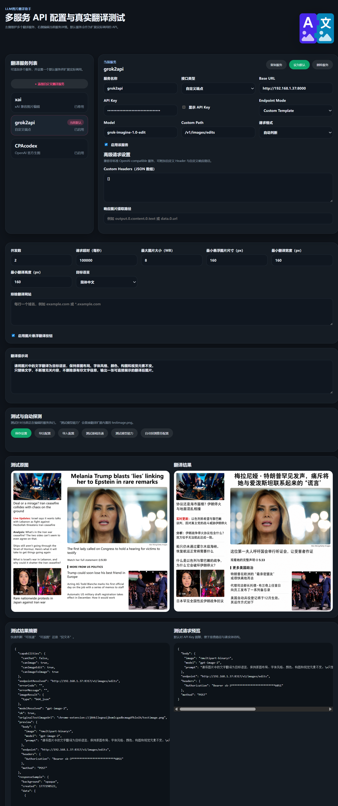
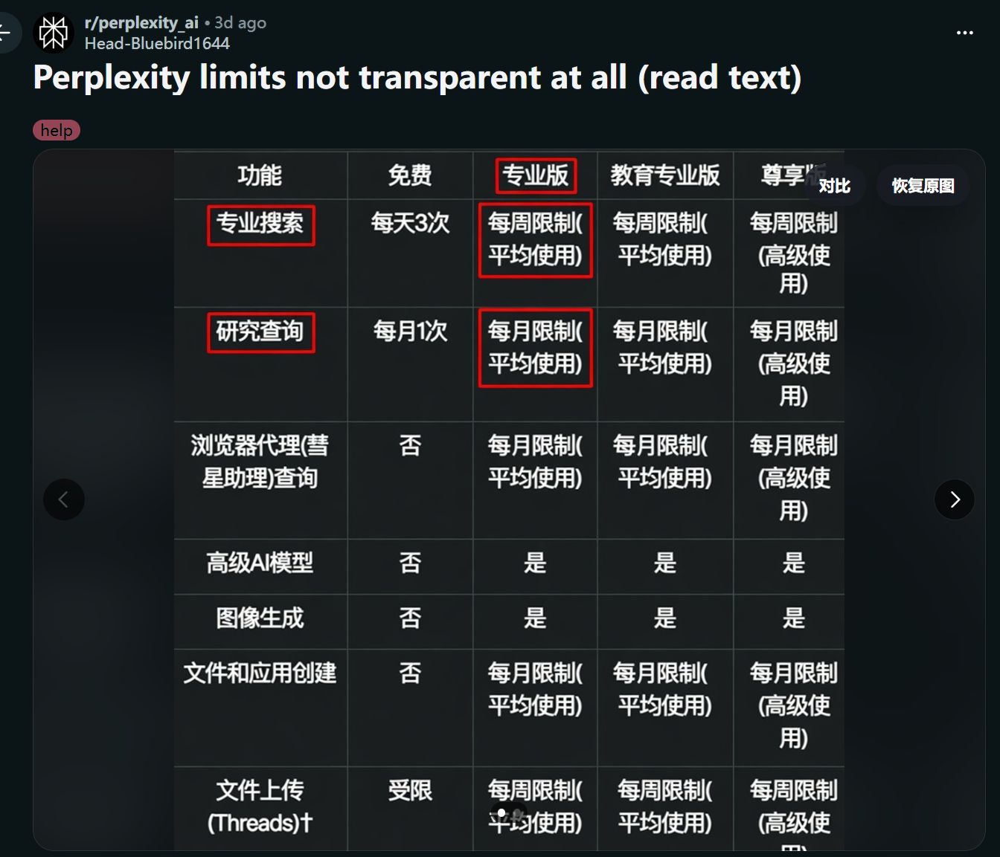
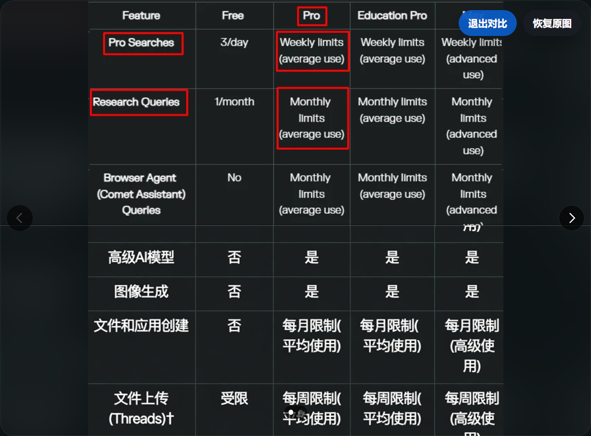
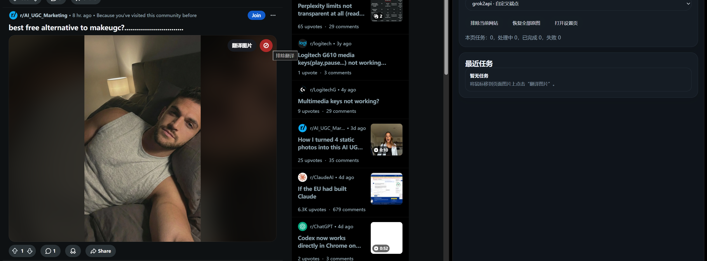

# LLM图片翻译助手

LLM图片翻译助手是一个 Chrome / Edge 浏览器扩展。它可以在网页图片上显示翻译入口，调用用户配置的多模态模型接口生成翻译后的图片，并在原页面中展示结果。

英文名：`LLM image translator`  
仓库名：`llm-image-translator`

## 链接

- [Chrome Web Store](https://chromewebstore.google.com/detail/llm-image-translator/pgabkmcliemlpgjdkppcecnlkjiicjcg)
- [项目主页](https://xianyudaxian.github.io/llm-image-translator/)
- [隐私政策](https://xianyudaxian.github.io/llm-image-translator/privacy.html)
- [GitHub 仓库](https://github.com/XianYuDaXian/llm-image-translator)

## 功能

- 图片悬浮翻译：鼠标移到网页图片上时显示翻译按钮。
- 原位显示结果：翻译完成后直接在页面中替换展示结果图。
- 原图对比：支持查看翻译图与原图的上下滑动对比。
- 自定义服务：支持 OpenAI、Gemini、xAI 兼容接口和自定义端点。
- 多端点模式：支持 `responses`、`images`、`chat`、`custom`。
- 接口测试：设置页提供基础连通测试、模型能力测试和真实图片翻译测试。
- 本地缓存：支持远端图片 URL 缓存和 base64 图片的本地 Blob 缓存。
- 排除规则：支持排除单张图片或整个网站。
- 任务面板：支持查看当前页面任务、切换翻译服务和恢复原图。

## 截图

### 设置界面

### 翻译效果

### 原图对比

### 排除图片或网站

## 安装

### 从 Chrome Web Store 安装

打开 [Chrome Web Store 页面](https://chromewebstore.google.com/detail/llm-image-translator/pgabkmcliemlpgjdkppcecnlkjiicjcg)，点击安装。

### 从源码加载

1. 打开浏览器扩展管理页。
2. 开启开发者模式。
3. 选择加载已解压的扩展程序。
4. 选择本仓库目录。
5. 打开扩展设置页。
6. 填写 API 配置并执行测试。

## 配置

扩展默认不提供模型服务。用户需要在设置页中填写自己的模型端点、API Key 和模型名称。

支持的服务类型：

- OpenAI 官方生图
- Gemini 官方生图
- OpenAI 兼容生图
- Gemini 兼容生图
- xAI 兼容图片编辑
- 自定义端点

## 使用

1. 打开任意包含图片的网页。
2. 将鼠标移到图片上。
3. 点击翻译图片。
4. 等待任务完成。
5. 使用对比按钮查看原图。
6. 使用恢复原图按钮撤回结果图。

## 数据说明

扩展只在用户主动触发翻译或测试时发送图片数据。图片会发送到用户在设置页中配置的模型服务端点。

更多说明见 [隐私政策](https://xianyudaxian.github.io/llm-image-translator/privacy.html)。

## 限制

- 当前版本只处理 `` 图片。
- `chat` 端点只有在上游支持图片输入和图片输出时才可用于图片翻译。
- relay 模式当前只保留客户端适配入口，不包含后端实现。

## 致谢

特别致谢：[LINUX DO](https://linux.do)
